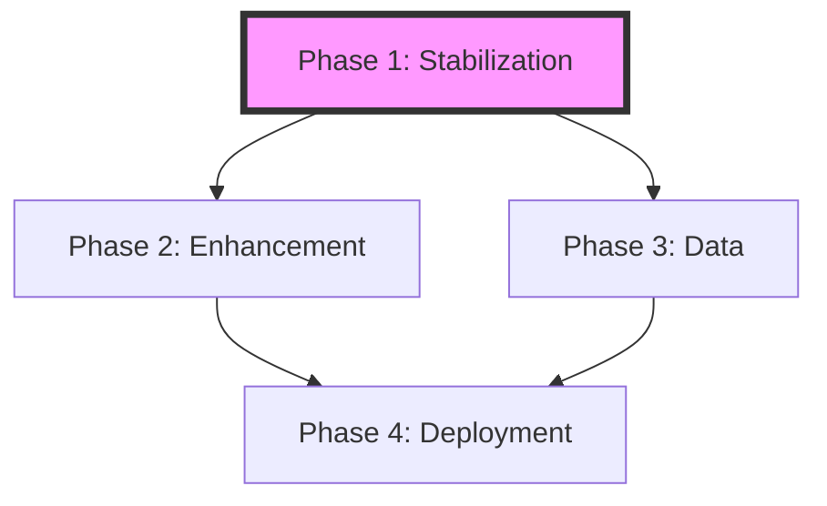

# Project State: Kỷ yếu A1

## Project Reference
**Core Value**: Digital yearbook for class 7A1 THCS Chu Văn An - Thanh Trì.
**Current Focus**: Roadmap creation and project foundation.

## Current Position
**Phase**: Phase 0 (Planning)
**Plan**: None
**Status**: Initializing Roadmap

**Progress Bar**:
[░░░░░░░░░░░░░░░░░░░░] 0%

## Performance Metrics
- **Requirements Covered**: 10/10 (100%)
- **Phases Defined**: 4
- **Success Criteria per Phase**: 2-3

## Accumulated Context
### Decisions
- [2024-05-19] Created PROJECT.md and REQUIREMENTS.md to establish project foundation.
- [2024-05-19] Adopted a 4-phase roadmap as requested by the user.
- [2024-05-19] Identified the need for major cleanup due to mixed application files in the project root.

### Todos
- [ ] Approve ROADMAP.md
- [ ] Begin Phase 1: Stabilization

### Blockers
- None.

## Session Continuity
**Current Session**: Roadmap Creation
**Last Action**: Wrote ROADMAP.md and STATE.md.
**Next Step**: Wait for user approval of the roadmap.
